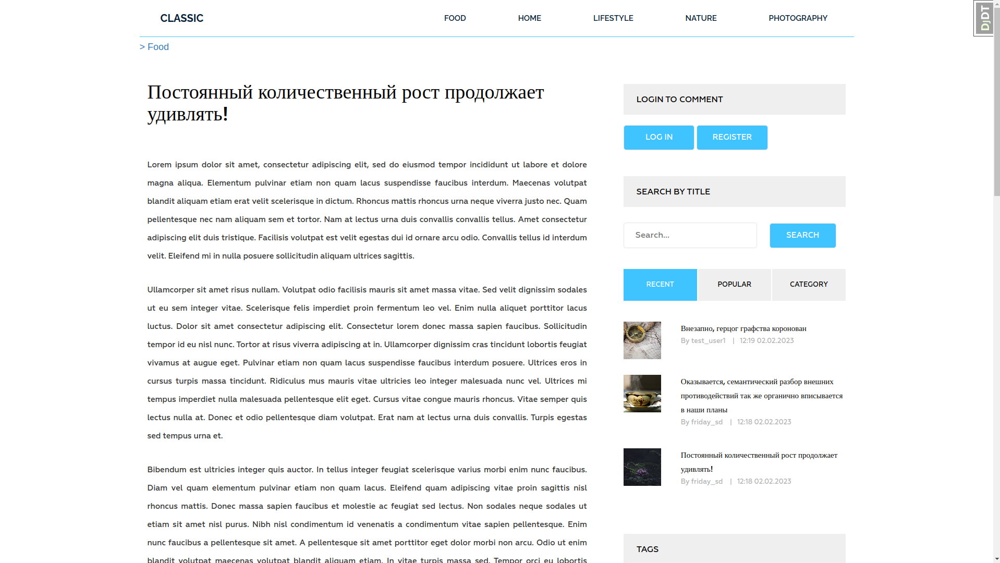
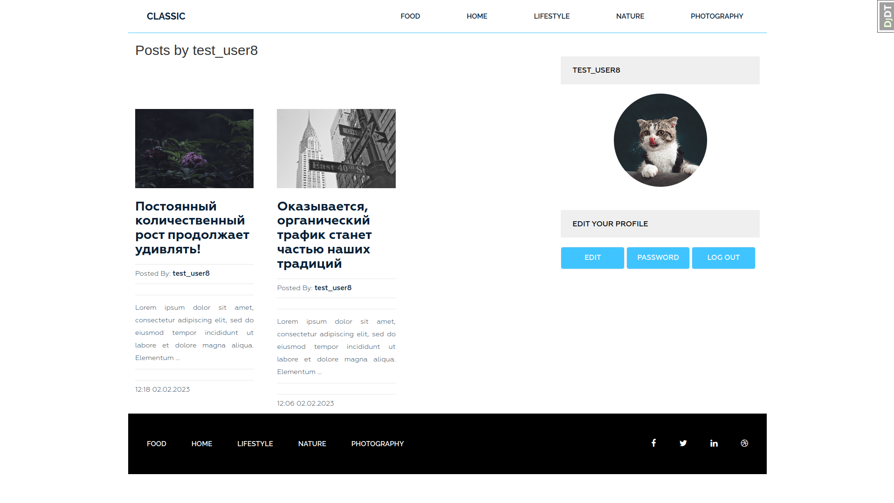

[](https://github.com/Friday-13/dartblog/blob/master/README.rus.md)
<h4 align="center"> Blog-project based on <a href="https://www.djangoproject.com/" target="_blank">Django</a>.</h4>


# About The Project

The goal of this project is creation of site with base blog functionality.

Frontend-part of this project is based on free open template [Dart Blog](https://www.free-css.com/free-css-templates/page247/dart-blog) (by DartThemes.com).

## Key Features
- Display a list of added posts;
- Ability to add post to one of the categories;
- Simple comment system;
- Tag system;
- Authorization system: registration, authorization, password change, etc;
- View post, grouped by category, tag or author;
- Search by post title;
- Ability to format post content with [Django CKEditor](https://django-ckeditor.readthedocs.io/en/latest/#).

<details>
<summary>Screenshots and demonstration</summary>

### Screenshots and demonstaration
- A list of posts on main page	
  

- A single post
  
	  
- A user page
  
	  
- An authorization form
  
</details>

## Built With
- [![Django][Django-label]][Django-url]
- [![CKEditor][CKEditor-label]][CKEditor-url]
- [![Bootstrap][Bootstrap-label]][Bootstrap-url]
- [![JQuery][Jquery-label]][Jquery-url]
- [![isotope][isotope-label]][isotope-url]

## DevTools
- [![Poetry][Poetry-label]][Poetry-url]
- [![djdebug][djdebug-label]][djdebug-url]

# Usage
## Prerequisites
1. Install [Python 3.11](https://www.python.org/downloads/)
2. Install [Poetry](https://python-poetry.org/docs/#installation)

## Installation
1. Clone the repository

```shell
$ git clone <% url %>   
```

2. Go into the repository

```shell
$ cd dartblog
```

3. Activate virtual environment, install dependencies and go into project folder

```shell
$ poetry shell
$ poetry install
$ cd siteblog
```

4. Change the file **../setenv.sh**
Parameter values are recommended to be filled in as strings, inserting values between quotes (`export PARAM='your_value'`)
- `SECRET_KEY` - [secret key](https://docs.djangoproject.com/en/dev/ref/settings/#std-setting-SECRET_KEY). Can be generated like this:

```shell
$ python manage.py shell
```

```python
>>> from django.core.management.utils import get_random_secret_key
>>> print(get_random_secret_key())
# Copy and paste the resulting string between '' into SECRET_KEY
>>> exit()
```

- `SMTP_HOST` - the host to use for sending email (`EMAIL_HOST` variable in **siteblog/settings.py**);
- `SMTP_EMAIL` - username to use for the SMTP server (`EMAIL_HOST_USER` variable in **siteblog/settings.py**);
- `SMTP_PASS` - password to use for the SMTP server (`EMAIL_HOST_PASSWORD` variable in **siteblog/settings.py**);
More information about these values can be found in [Django docs](https://docs.djangoproject.com/en/4.2/ref/settings/#email-host).

> **Note**
>  You may also need to change the `EMAIL_PORT` setting to match your host.

5. Activate environment variables

```shell
$ . ../setenv.sh
```

6. Collect static files

```shell
$ python manage.py collectstatic  
   
```

7. Make and apply migrations

```shell
$ python manage.py makemigrations
$ python manage.py migrate
```

8. Run test server

```shell
$ python manage.py runserver
```

Then you can work with the project in the same way as with any other django project: fill the database, create an administrator, and so on.

# License

Distributed under the MIT License. See **LICENSE.md** for more information.

# Contact

Dmitry Samsonenko - samsondm97@gmail.com

# Acknowledgments
- [WebforMyself](https://webformyself.com/)
- [OrdinaryCoders](https://ordinarycoders.com/blog/article/custom-user-login-forms)
- [DEV](https://dev.to/earthcomfy/django-reset-password-3k0l)
- [Диджитализируй!](https://www.youtube.com/@t0digital)


[Django-url]: https://www.djangoproject.com/
[Django-label]: https://img.shields.io/badge/django-19447c?style=for-the-badge&logo=django&logoColor=D45428

[CKEditor-url]: https://pypi.org/project/django-ckeditor/
[CKEditor-label]: https://img.shields.io/badge/ckeditor-19447c?style=for-the-badge&logo=pypi&logoColor=D45428

[Bootstrap-url]: https://getbootstrap.com/docs/5.2/
[Bootstrap-label]: https://img.shields.io/badge/bootstrap-19447c?style=for-the-badge&logo=bootstrap&logoColor=D45428

[Jquery-url]: https://jquery.com/
[Jquery-label]: https://img.shields.io/badge/jquery-19447c?style=for-the-badge&logo=jquery&logoColor=D45428

[isotope-url]: https://isotope.metafizzy.co/
[isotope-label]: https://img.shields.io/badge/isotope-19447c?style=for-the-badge&logo=npm&logoColor=D45428

[djdebug-url]: https://pypi.org/project/django-debug-toolbar/ 
[djdebug-label]: https://img.shields.io/badge/django_debug_toolbar-19447c?style=for-the-badge&logo=pypi&logoColor=D45428

[poetry-url]: https://python-poetry.org/docs/#installation
[poetry-label]: https://img.shields.io/badge/poetry-19447c?style=for-the-badge&logo=poetry&logoColor=D45428

