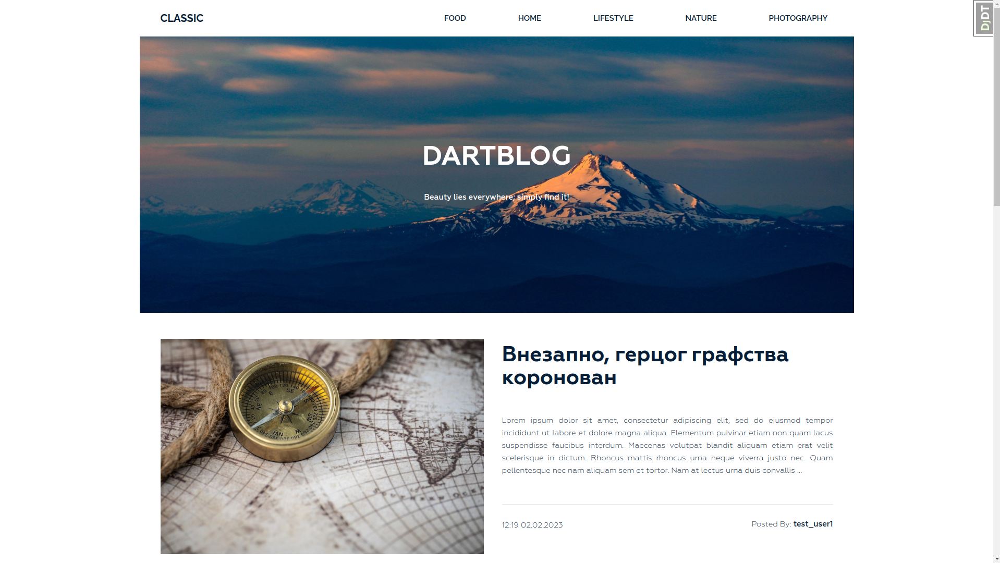
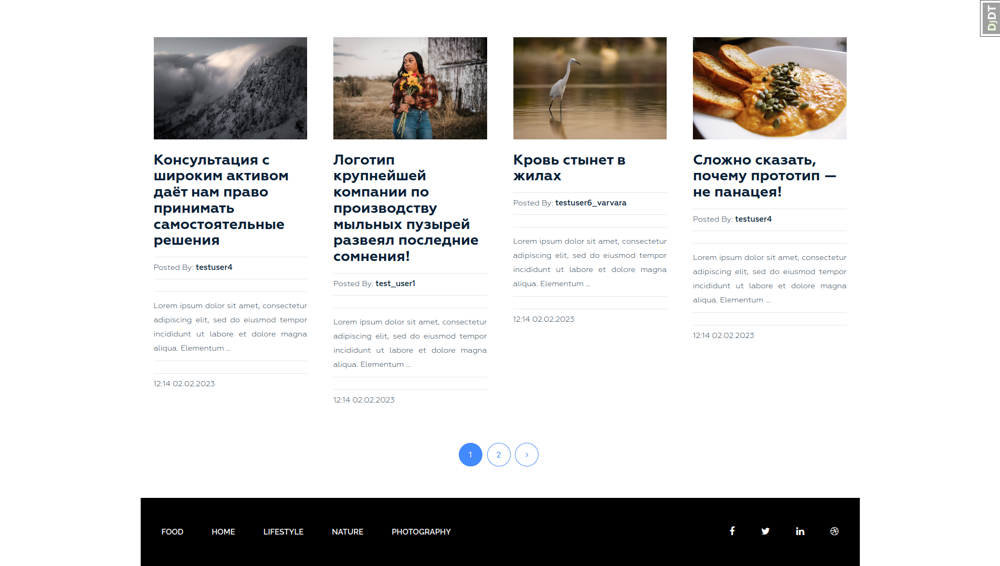
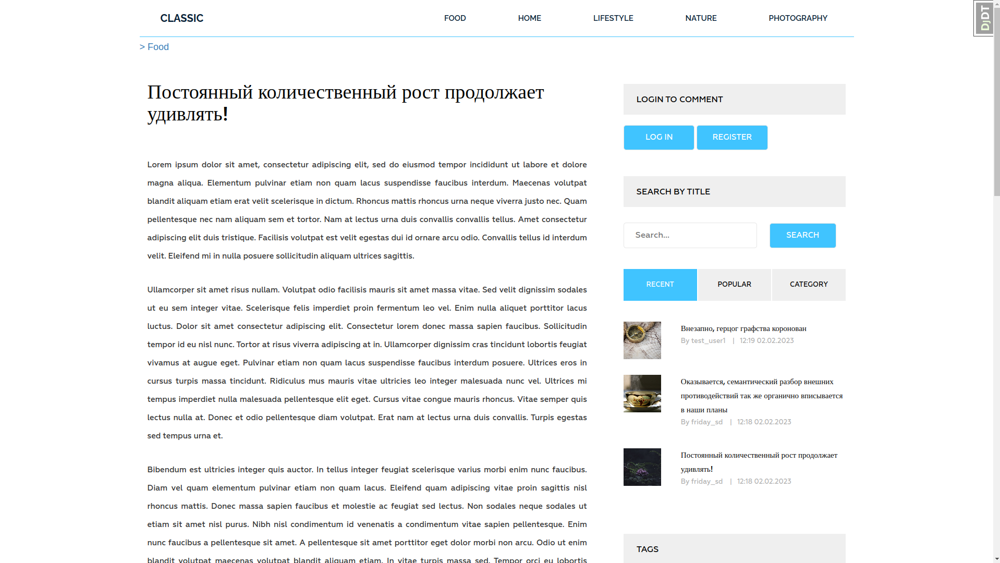
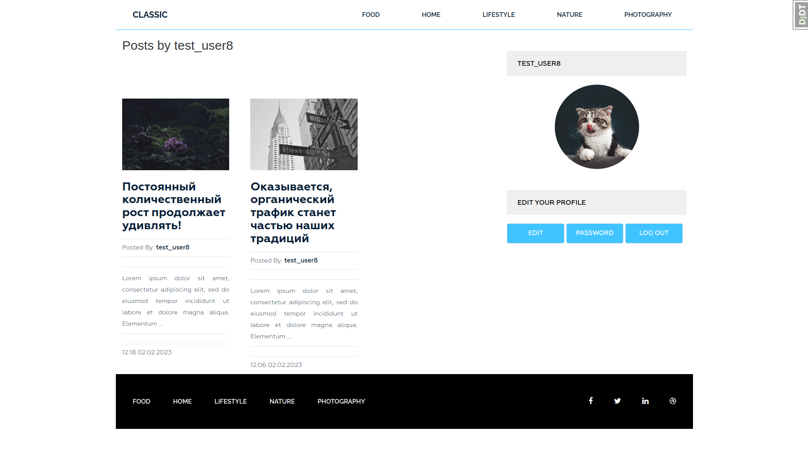
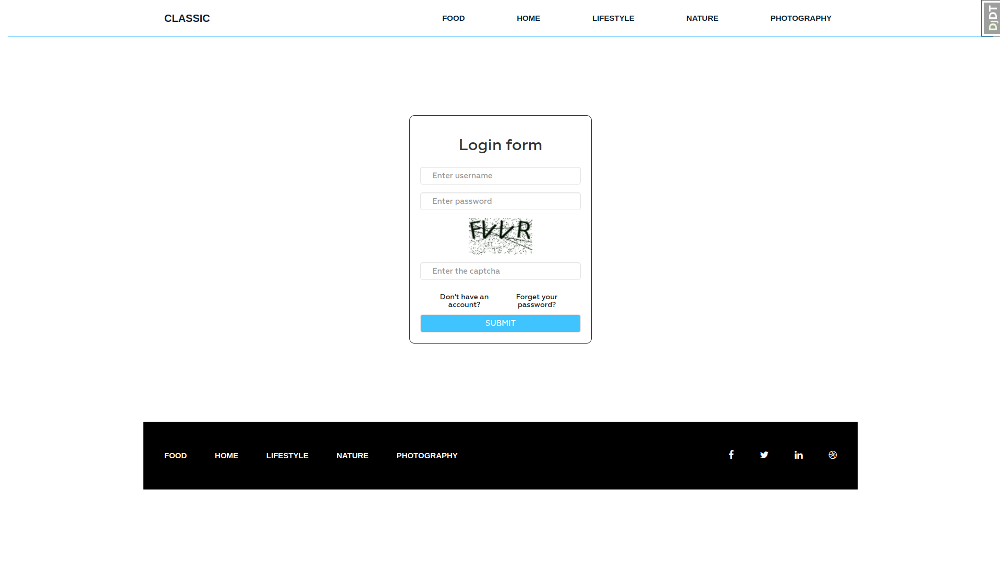

[](https://github.com/Friday-13/dartblog/blob/master/README.md)
<h6 align="center"> Проект блога с использованием <a href="https://www.djangoproject.com/" target="_blank">Django</a>.</h4>



# О проекте

Цель этого проекта - создание сайта с функционалом блога.

За основу фронтенд-части был взят бесплатный открытый шаблон [Dart Blog](https://www.free-css.com/free-css-templates/page247/dart-blog)(от DartThemes.com).

## Основные возможности
- Отображение списка добавленных постов;
- Возможность добавлять посты в одну из категорий;
- Простая система комментариев;
- Система тегов;
- Система авторизации: регистрация, авторизация, смена пароля и тд;
- Просмотр постов по категориям, тегам, автору;
- Поиск по названию поста;
- Возможность форматировать содержимое поста с помощью [Django CKEditor](https://django-ckeditor.readthedocs.io/en/latest/#).


### Демонстрация некоторых возможностей

<details>
<summary>Скриншоты и демонстрация возможностей</summary>

- Список постов на главной странице	
  

- Отдельный пост
  
	  
- Страница пользователя
  
	  
- Форма авторизация
  
</details>

## Разработано с помощью
- [![Django][Django-label]][Django-url]
- [![CKEditor][CKEditor-label]][CKEditor-url]
- [![Bootstrap][Bootstrap-label]][Bootstrap-url]
- [![JQuery][Jquery-label]][Jquery-url]
- [![isotope][isotope-label]][isotope-url]

## Инструменты разработки
- [![Poetry][Poetry-label]][Poetry-url]
- [![djdebug][djdebug-label]][djdebug-url]

# Использование
## Предварительные требования
1. Установить [Python 3.11](https://www.python.org/downloads/)
2. Установить [Poetry](https://python-poetry.org/docs/#installation)

## Развертывание
1. Клонировать текущий репозиторий

```shell
$ git clone <% url %>   
```

2. Перейти в папку репозитория

```shell
$ cd dartblog
```

3. Активировать виртуальное окружение, установить зависимости и перейти в папку проекта

```shell
$ poetry shell
$ poetry install
$ cd siteblog
```

4. Изменить файл **../setenv.sh**
Значения параметров рекомендуется заполнять в виде строк, вставляя значения между кавычек (`export PARAM='your_value'`)
- `SECRET_KEY` - [секретный ключ](https://docs.djangoproject.com/en/dev/ref/settings/#std-setting-SECRET_KEY).  Может быть сгенерирован следующим образом:

```shell
$ python manage.py shell
```

```python
>>> from django.core.management.utils import get_random_secret_key
>>> print(get_random_secret_key())
# Скопируй и вставь полученную строку между '' параметра SECRET_KEY
>>> exit()
```

- `SMTP_HOST` - хост для отправки электронных сообщений (соответствует переменной `EMAIL_HOST` в файле **siteblog/settings.py**)
- `SMTP_EMAIL` - email, используемый для отправки сообщений (соответствует переменной `EMAIL_HOST_USER` в файле **siteblog/settings.py**);
- `SMTP_PASS` - пароль для smtp-сервера (соответствует переменной `EMAIL_HOST_PASSWORD` в файле **siteblog/settings.py**);
Подробнее про эти значения можно посмотреть в [документации к Django](https://docs.djangoproject.com/en/4.2/ref/settings/#email-host).

> **Note**
>  Возможно, вам также потребуется изменить параметр `EMAIL_PORT` в соответствии со своим хостом.

5. Активировать переменные окружения

```shell
$ . ../setenv.sh
```

6. Собрать статику

```shell
$ python manage.py collectstatic  
   
```

7. Выполнить миграции

```shell
$ python manage.py makemigrations
$ python manage.py migrate
```

8. Запустить тестовый сервер

```shell
$ python manage.py runserver
```

Далее можно работать с проектом так же, как и с любым другим django-проектом: заполнять базу данных, создавать администратора и тд.

# Лицензия

Распространяется по лицензии MIT. См. файл **LICENSE.md**. дополнительную информацию.

# Контакты

Дмитрий Самсоненко - samsondm97@gmail.com

# Благодарности
- [WebforMyself](https://webformyself.com/)
- [OrdinaryCoders](https://ordinarycoders.com/blog/article/custom-user-login-forms)
- [DEV](https://dev.to/earthcomfy/django-reset-password-3k0l)
- [Диджитализируй!](https://www.youtube.com/@t0digital)


[Django-url]: https://www.djangoproject.com/
[Django-label]: https://img.shields.io/badge/django-19447c?style=for-the-badge&logo=django&logoColor=D45428

[CKEditor-url]: https://pypi.org/project/django-ckeditor/
[CKEditor-label]: https://img.shields.io/badge/ckeditor-19447c?style=for-the-badge&logo=pypi&logoColor=D45428

[Bootstrap-url]: https://getbootstrap.com/docs/5.2/
[Bootstrap-label]: https://img.shields.io/badge/bootstrap-19447c?style=for-the-badge&logo=bootstrap&logoColor=D45428

[Jquery-url]: https://jquery.com/
[Jquery-label]: https://img.shields.io/badge/jquery-19447c?style=for-the-badge&logo=jquery&logoColor=D45428

[isotope-url]: https://isotope.metafizzy.co/
[isotope-label]: https://img.shields.io/badge/isotope-19447c?style=for-the-badge&logo=npm&logoColor=D45428

[djdebug-url]: https://pypi.org/project/django-debug-toolbar/ 
[djdebug-label]: https://img.shields.io/badge/django_debug_toolbar-19447c?style=for-the-badge&logo=pypi&logoColor=D45428

[poetry-url]: https://python-poetry.org/docs/#installation
[poetry-label]: https://img.shields.io/badge/poetry-19447c?style=for-the-badge&logo=poetry&logoColor=D45428

